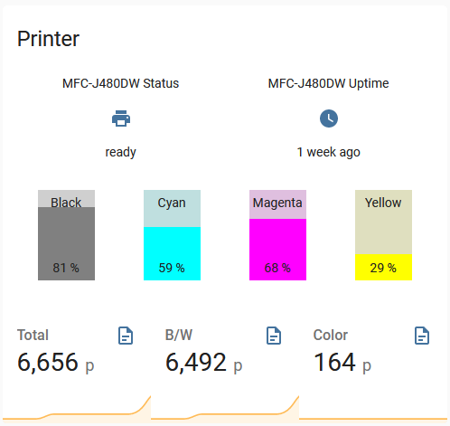
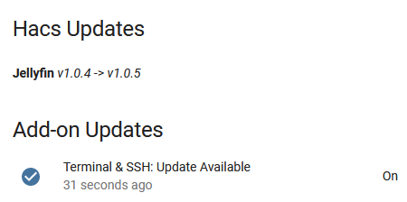

# Home Assistant Config

This repository hosts my [Home Assistant](https://home-assistant.io) configuration files.

## Screenshots
### **Bedroom Controls**
  

### **Raspberry Pi Status**
  
Monitoring of host machine and Home Assistant status.

### **Printer Status**
  

Monitoring of printer status. I get notified when ink replacement is needed.

### **Main Dashboard** 

### **Internet Status**
  

### **Updates Card**

You can find my Updates Card code [here](docs/updates.md).

## Structure
You'll be unable to reproduce my own Home Assistant instance using these files directly. However, you are welcome to use this repo as inspiration for your own instance.  
Note that it is recommended that you install the included custom components and python scripts directly from their source (rather than this repository).

The main Home Assistant configuration file is `configuration.yaml`. Most of my configuration is located within the yaml folder.
My Lovelace UI configuration can be seen in the storage folder.

## Cool Automations
* `Power Saving Automation:` A set of automations that use tracking sensors (mostly, my phone's internet connection) to shut down devices when I'm away. It announces before taking action using the smart speaker, and has an override boolean switch, for times when others are visiting.
* `AC and Fan Related:` Some of these automations ensure exclusive operation of either ceiling fan or air condition unit within the same room. Another automation repeats the On or Off signals, since my IR remote is not reliable enough. A useful automation is activated while I'm asleep - turning the AC on/off when the room becomes uncomfortably hot/cold, and also turning the fan on 15 minutes after turning the AC unit off.  
* `Music-Light Coordination:` Setting RGB light color based on current track's artwork from Spotify.
* `Notifications and Warnings:` Using telegram to notify of abnormal operation and other interesting information I like track.
* `Power Outage response:` My Home Assistant unit is hosted behind a UPS that does not provide an easy way to signal and trigger graceful shutdown. I recognize a power outage by multiple local devices' state, and trigger a shutdown. I also have automations that get various devices in specific state ahead of a planned power outage.

## My Hardware
* Raspberry Pi 4
* SSD Drive (Transcend)
* M.2 SATA USB-3 Enclosure (by Ugreen)
* Sonoff iFan03 (flashed with Tasmota)
* Shelly 2.5 (to control rolling shutters)
* Yeelight Color
* [IOTLink](https://iotlink.gitlab.io/) for Windows
* [Hass Workstation Service](https://github.com/sleevezipper/hass-workstation-service) for Windows (IOTLink became unreliable on a certain machine)
* Google Home Mini

## Plugins
In order to expand the experience and capabilities that are supplied by Home Assistant from the box, I use the following additional plugins:

### Android App
I'm using the [Home Assistant Companion](https://companion.home-assistant.io/) app to display the frontend on my phone. I also created multiple widgets that are displayed on my launcher home screen.  
It's a great app that also provides an incredible amount* of sensors that allow monitoring the phone's state over Home Assistant.

**Incredible amount = even as a data lover (and hoarder), I decided to disable some sensors.*

### Custom Components (Integrations)

[HACS](https://hacs.xyz/) - Custom Components, Cards, Themes and more can be installed using HACS.  
[Blitzortung](https://github.com/mrk-its/homeassistant-blitzortung) via HACS - tracks lightning strikes nearby. Offering sensors and displays strikes on the map component.  
[Jellyfin](https://github.com/koying/jellyfin_ha) via HACS - media player integration for Jellyfin (an open-source Plex alternative).  
[Places](https://github.com/custom-components/places) via HACS - reverse geocoding (device_tracker -> meaningful location string) using OpenStreetMap. My version is modified to support language choice and build the resulting string differently.  
[Popular Times](https://github.com/freakshock88/hass-populartimes) via HACS - popularity of a place by Google Maps API.  
[SmartIR](https://github.com/smartHomeHub/SmartIR) via HACS - using an IR controller to create climate devices, media players and fans.  
[Shellies Discovery](https://github.com/bieniu/ha-shellies-discovery) via HACS Automations - MQTT discovery support for Shelly devices.  

### Frontend Cards
I use the following cards to extend the lovelace UI. All of the following are installed using HACS.

[Atomic Calendar Revive](https://github.com/marksie1988/atomic-calendar-revive) - displays a nice customizable calendar.  
[auto-entities](https://github.com/thomasloven/lovelace-auto-entities) - I use it to create a card of active automations and another card of inactive ones. I also use it to automatically populate cards with multiple related entities.  
[Bar Card](https://github.com/custom-cards/bar-card) - provides nice display for my printer ink supply.  
[Compass Card](https://github.com/tomvanswam/compass-card) - used to display latest lightning strike's direction and distance.  
[fold-entity-row](https://github.com/thomasloven/lovelace-fold-entity-row) - collapses many rows of my phone's sensors into a single row.  
[hui-element](https://github.com/thomasloven/lovelace-hui-element)  - it's kind of a cheat card, allowing me to display the *Restriction Card* as a row instead of a full card.  
[Lovelace Swipe Navigation](https://github.com/maykar/lovelace-swipe-navigation) - allows swiping between views on mobile.  
[Mini Graph Card](https://github.com/kalkih/mini-graph-card) - a highly customizable history graph card.  
[Mini Media Player](https://github.com/kalkih/mini-media-player) - a highly customizable media player card.  
[Multiple Entity Row](https://github.com/benct/lovelace-multiple-entity-row) - combines multiple entities and attributes in a single row.  
[Restriction Card](https://github.com/iantrich/restriction-card) - protects me from accidental touches by adding a "lock" that can be dismissed either by an additional tap or after confirming an alert that I set up.  
[Simple Thermostat](https://github.com/nervetattoo/simple-thermostat) - nice display for Air Condition control.  
[slider-entity-row](https://github.com/thomasloven/lovelace-slider-entity-row) - an easy to use slider for my cover postition setting.  
[Swipe Card](https://github.com/bramkragten/swipe-card) - I use it for my weather entities cards (now, today, tomorrow) - each has many rows. Only the first card is displayed and the rest are accessible by swiping it.  
[Transmission Card](https://github.com/amaximus/transmission-card) - designed to display info and control Transmission torrent client.  
[TV Remote Card](https://github.com/marrobHD/tv-card) - displays a gigantic remote that I set up to control my streamer.  
[Vacuum Card](https://github.com/denysdovhan/vacuum-card) - an elegant card for my Roomba vacuum cleaner.  
[Vertical Stack in Card](https://github.com/ofekashery/vertical-stack-in-card) - grouping multiple cards inside one. Like built-in vertical-stack, but with less padding.  

### Home Assistant Supervised Add-ons
Home Assistant Supervised environment (formerly called Hassio) allows running Docker based add-ons on the same machine. Some Add-ons are available within the default repository. Others require adding custom repositories.

[AdGuard Home](https://github.com/hassio-addons/addon-adguard-home) - local DNS server with added benefit of ad filtering.  
[Assistant Relay](https://github.com/Apipa169/Assistant-Relay-for-Hassio) - using google assistant's broadcast capabilities for TTS. Unfortunately, it currently struggles with IPv6, so I don't use it.  
[chrony](https://github.com/hassio-addons/addon-chrony) - local NTP server.  
[File Editor](https://github.com/home-assistant/hassio-addons/tree/master/configurator) - web based editor for Home Assistant's configuration files.  
[Grafana](https://github.com/hassio-addons/addon-grafana) - for visualizing *InfluxDB* data.  
[Grocy](https://github.com/hassio-addons/addon-grocy) - for managing my stock at home.  
[Grocy's Barcode Buddy](https://github.com/Forceu/barcodebuddy) - easier way to scan products into Grocy (not available as an add-on, deployed on docker via *Portainer*).  
[Home Assistant Google Drive Backup](https://github.com/sabeechen/hassio-google-drive-backup) - managing local and cloud snapshots of Home Assistant.  
[InfluxDB](https://github.com/hassio-addons/addon-influxdb) - used for long term data storage.  
[MariaDB](https://github.com/home-assistant/hassio-addons/tree/master/mariadb) - hosting Home Assistant main database.  
[Mosquitto broker](https://home-assistant.io/addons/mosquitto/) - MQTT broker used to connect IOT devices with Home Assistant.  
[NGINX Proxy Manager](https://github.com/hassio-addons/addon-nginx-proxy-manager) - Proxy server for Home Assistant. It allows me to serve remote connections via HTTPS while keeping local connectivity via HTTP. *Previously used [NGINX Home Assistant SSL proxy](https://github.com/home-assistant/hassio-addons/tree/master/nginx_proxy) addon which has a more straightforward approach.*  
[Portainer](https://github.com/hassio-addons/addon-portainer) - web based Docker management.  
[Samba share](https://github.com/home-assistant/hassio-addons/tree/master/samba) - exposing folders locally via SMB.  
[Terminal & SSH](https://github.com/home-assistant/hassio-addons/tree/master/ssh) - web terminal and SSH server.  
[WireGuard](https://github.com/hassio-addons/addon-wireguard) - VPN server hosted locally.  